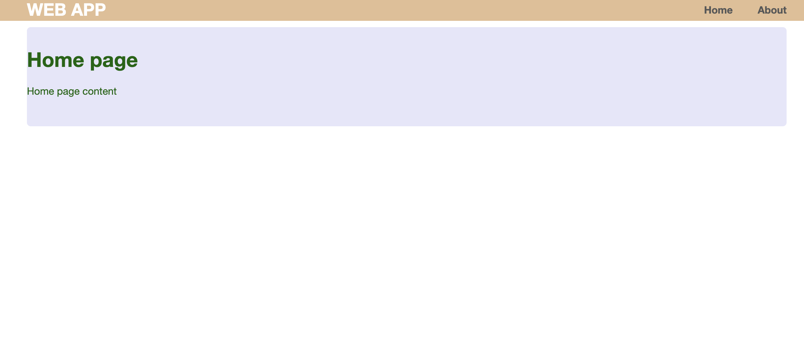

[](https://www.python.org/)
[](https://github.com/psf/black)
[](LICENSE.md)

# Flask deployment template

> A simple flask web-site deployment template.

## Tools

- python 3.7+
- html & css
- [flask](https://flask.palletsprojects.com/en/2.0.x/) 
- [black](https://black.readthedocs.io/en/stable/)

## Usage



### Source code

```bash
git clone git@github.com:vyahello/flask-deploy-template.git
cd flask-deploy-template
python3 -m venv venv 
. venv/bin/activate
pip install -r requirements.txt
python app.py
```

Then please open http://localhost:5000 in your browser.

**[⬆ back to top](#flask-deployment-template)**

## Deployment 

### PythonAnywhere

TBD

## Development notes

### Meta

Author – _Vladimir Yahello_.

Distributed under the `MIT` license. See [license](LICENSE.md) for more information.

You can reach out me at:
* [vyahello@gmail.com](vyahello@gmail.com)
* [https://twitter.com/vyahello](https://twitter.com/vyahello)
* [https://www.linkedin.com/in/volodymyr-yahello-821746127](https://www.linkedin.com/in/volodymyr-yahello-821746127)

### Contributing

I would highly appreciate any contribution and support. If you are interested to add your ideas into project please follow next simple steps:

1. Clone the repository
2. Configure `git` for the first time after cloning with your `name` and `email`
3. `pip install -r requirements.txt` to install all project dependencies
4. `pip install -r requirements-dev.txt` to install all development project dependencies
5. Create your feature branch (git checkout -b feature/fooBar)
6. Commit your changes (git commit -am 'Add some fooBar')
7. Push to the branch (git push origin feature/fooBar)
8. Create a new Pull Request

### What's next

All recent activities and ideas are described at project [issues](https://github.com/vyahello/flask-deploy-template/issues) page. 
If you have ideas you want to change/implement please do not hesitate and create an issue.

**[⬆ back to top](#flask-deployment-template)**
